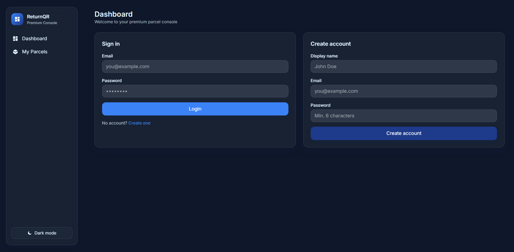
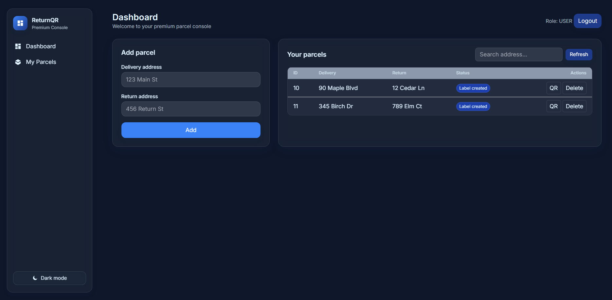
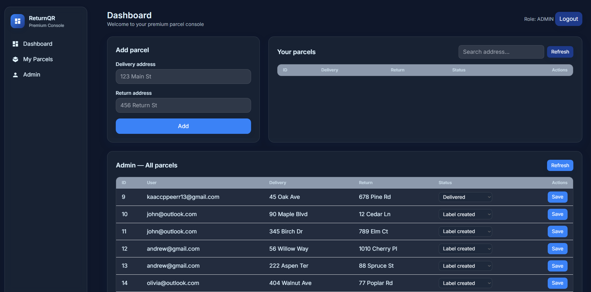
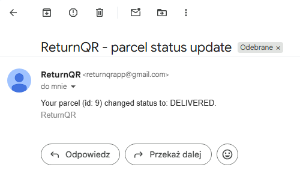
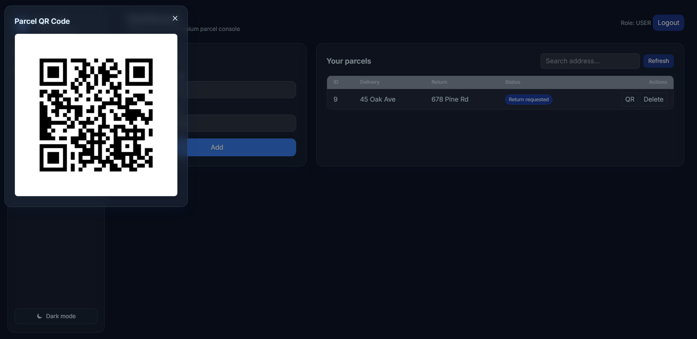

# 📦 ReturnQR

ReturnQR is a **parcel tracking and return management system** built with **Spring Boot**.  
It demonstrates full backend capabilities including **authentication, role-based authorization, parcel workflow, QR code generation, and email notifications**.

The frontend was generated with AI — the focus of this project is **backend development**.

---

## 🚀 Features

- **User authentication & authorization** with JWT
    - Roles: `USER` and `ADMIN`
    - Secure login & registration
- **Parcel lifecycle management**
    - Statuses: `CREATED`, `LABEL_CREATED`, `SENT`, `DELIVERED`, `RETURN_REQUESTED`, `RETURNED`

- **Email notifications** Users receive emails when parcel status changes
- **QR code generation** for each parcel
- **PostgreSQL database** with JPA/Hibernate
- **Docker Compose setup** for local development
- **Clean architecture**: controllers → services → repositories → models → DTOs
- **Async processing** for email sending

---

## 🛠️ Tech Stack

- **Java 17**
- **Spring Boot 3**
  - Spring Security (JWT)
  - Spring Data JPA
  - Spring Validation
  - Spring Mail
- **PostgreSQL**
- **Docker & Docker Compose**
- **Lombok**
- **ZXing** (QR code generation)

---
## 🎯 Functionalities

### As a User
- **Register and login** – create a new account as a user and log in using JWT-based authentication.
- **Create a parcel** – provide delivery and return addresses to register a new parcel in the system.
- **Request a return** – when a parcel status becomes `DELIVERED`, the user can create a return request.
- **Generate a QR code** – for each parcel, the system generates a simple QR code containing the return address and the user’s name.

### As an Admin
- **Manage parcel statuses** – update the status of any parcel (`CREATED → SENT → DELIVERED → RETURN_REQUESTED → RETURNED`).
- **Automatic email notifications** – whenever an admin changes a parcel’s status, the user receives an email with the update.

---


## 🔒 Security

- Stateless authentication with JWT
- Role-based access:
    - `/api/admin/**` → `ADMIN` only
    - `/api/users/**` & `/api/parcels/**` → `USER` or `ADMIN`
- Passwords hashed with BCrypt

---


## 📂 Project Structure

```
returnqr/
├── config/         # Seed data (admin user)
├── controller/     # REST controllers (Auth, User, Parcel, Admin)
├── dto/            # Data transfer objects
├── mapper/         # Entity <-> DTO mappers
├── model/          # JPA entities (User, Parcel, etc.)
├── repository/     # Spring Data JPA repositories
├── security/       # JWT filter, service, config
├── service/        # Business logic (Auth, Parcel, Email, QR)
```

---

## ⚙️ Setup

### Prerequisites
- Java 17+
- Docker & Docker Compose


### Configuration

The application uses **environment variables** for sensitive data.

#### Windows (PowerShell)
```powershell
setx JWT_SECRET "your-secret-key"
setx MAIL_USERNAME "your_email@gmail.com"
setx MAIL_PASSWORD "your_password"
setx MAIL_FROM "ReturnQR <noreply@returnqr.com>"
```
After setting, restart PowerShell or your IDE.

#### Linux / macOS (bash/zsh)
```bash
export JWT_SECRET=your-secret-key
export MAIL_USERNAME=your_email@gmail.com
export MAIL_PASSWORD=your_password
export MAIL_FROM="ReturnQR <noreply@returnqr.com>"
```


### Run with Docker Compose (recommended)

```bash
docker-compose up -d
./gradlew bootRun
```

This starts:
- PostgreSQL on `localhost:5432`
- Spring Boot app on `localhost:8080`


---

## 📸 Screenshots

> Add your own screenshots to the `docs/` folder and link them here.

- **Login/Register**  
  

- **User view**  
  

- **Admin view**  
  

- **Received email**  
  

- **Generated QR**  
  
---


